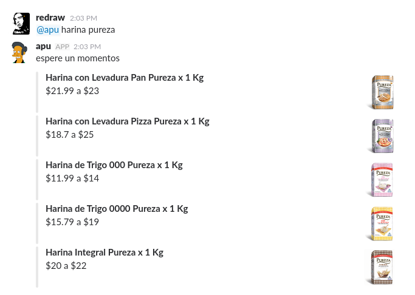

# apu

## Slack bot
```bash
cd slack
npm install
SLACK_TOKEN=<SLACK-TOKEN> LAT=<LAT> LNG=<LNG> node run.js
```



## Telegram bot
```bash
cd telegram
vercel deploy
curl https://api.telegram.org/bot<TOKEN>/setWebhook?url=https://$DEPLOYMENT_URL.vercel.app/api
```